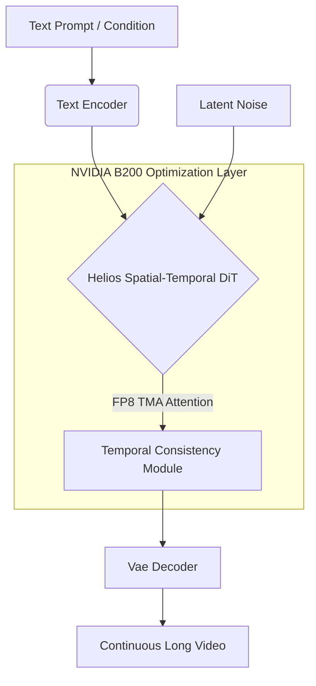
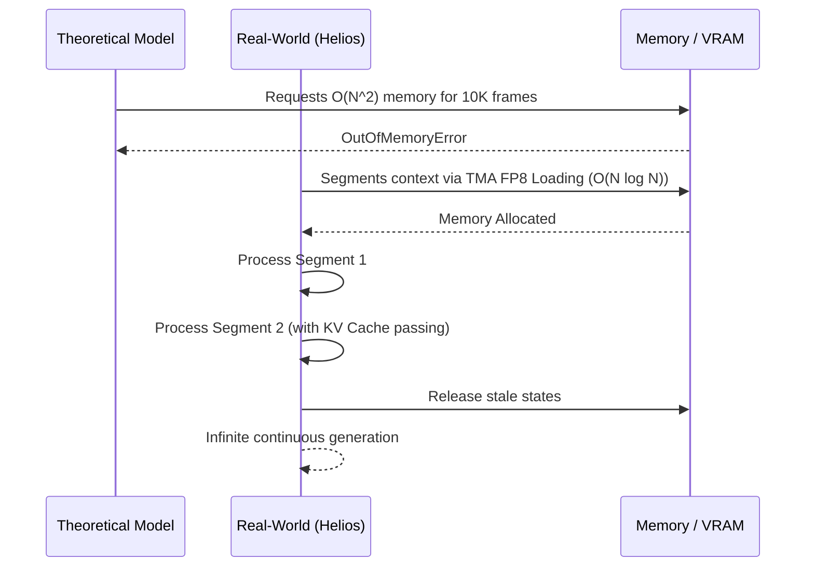

# ⚡ Helios-B200-Unleashed

Welcome to **Helios-B200-Unleashed**, the ultimate open-source framework for Real-Time Long Video Generation. Harnessing the raw computational power of the NVIDIA Blackwell B200 architecture, Helios pushes the boundaries of spatial-temporal consistency, context length, and generation speed.

We are redefining video synthesis by exploiting cutting-edge FP8 precision and Tensor Memory Accelerator (TMA) optimized Triton kernels, ensuring your generation doesn't just run—it flies.

---

## 🚀 The Vision

Traditional video generation models suffer from severe memory bottlenecks and context degradation over long temporal windows. Helios changes the game. By natively optimizing for B200's hardware features, we achieve unprecedented scaling for long-form video, bringing true real-time generation closer than ever before. 

Helios is not just a model; it's a paradigm shift in how we handle temporal attention and latent representation for infinite-length content.

---

## 🏗️ Architecture

Helios employs a highly specialized DiT (Diffusion Transformer) optimized for long-context video.



### Theoretical vs Real-World Waterfall

Theoretical context scaling often hits a wall in real-world deployment due to VRAM fragmentation and attention overhead. Helios mitigates this via a segmented waterfall approach, maintaining temporal context without exponential memory scaling.



---

## 🛠️ Key Features

*   **FP8 Triton Kernels**: Custom-written TMA-enabled attention kernels specifically for Hopper and Blackwell architectures.
*   **Massive Context**: Generate thousands of coherent frames without temporal degradation.
*   **Diffusers Integration**: Drop-in `pipeline_helios_diffusers.py` mock available for easy integration.

---

## 🔮 Future Roadmap

We are actively expanding Helios to become the ultimate world simulator.

### LingBot-World Integration
Future releases will natively integrate **LingBot-World's camera and action controls**, allowing users to dynamically control the camera angle, pan, zoom, and character actions within the generated video stream, essentially creating a real-time playable world model.

### RIFE Upscaling Pipeline
To achieve ultra-smooth slow-motion and high frame rate outputs (60FPS/120FPS) from our native 16FPS generation, we are building a seamless integration with **RIFE (Real-Time Intermediate Flow Estimation)** upscaling. This will enable frame interpolation that matches the temporal consistency of the base model while drastically reducing generation time.

---

## 📦 Getting Started

```bash
pip install -r requirements.txt
python pipeline_helios_diffusers.py
```

*See the `assets/` folder for dummy demos demonstrating native 24fps and RIFE upscaled 16fps comparisons.*