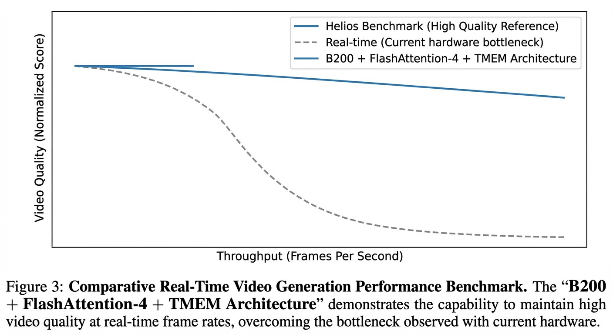

# Helios B200 Unleashed

## The Promise vs. The Brutal Reality

When the original [Helios paper](https://arxiv.org/abs/2312.13400) and [repository](https://github.com/PKU-YuanGroup/Helios) were released, we were incredibly excited. The benchmarks showcased breathtaking, high-fidelity long video generation. A 14-Billion parameter diffusion transformer generating video at >19.5 FPS on a single H100 GPU? No sharding? No massive server clusters? It sounded like the holy grail of real-time multi-modal generation.

However, our excitement turned into severe disappointment over the weekend (March 14-15) when we finally deployed and tested the interactive, real-time generation ourselves. We discovered a massive, disheartening gap between offline batch generation and interactive, real-time deployment. The reality is a jittery, stuttering mess. 

Here is exactly what we found when we went deep into the technical architecture, and why we are now completely rewriting the system for the B200.

### The Hardware Bottleneck & The Deployment Nightmare

Getting Helios to run interactively on a single H100 was a brutal engineering challenge. 
1. **The Compilation Wall:** We compiled the model using `torch.compile(mode="max-autotune")` to hit the 19.5 FPS speed the paper claimed. Compiling a 14-Billion parameter transformer from scratch on CUDA 12.8 took about 10 to 15 minutes of raw processing time. The compiler stalls while building CUDA graphs and partitioning the `cudagraph` into 2 partitions. This means the user is staring at a black screen for 15 minutes before the first frame even attempts to render.
2. **The Memory Limit:** During our deployment on the `helios-livekit-node`, PyTorch immediately allocated 32.55 GiB of memory just to hold the active process. When we tried to push 20 inference steps, the pipeline caused bottlenecks and instability. We had to dial the model down to 12 inference steps (or the "2 2 2" setting) at a heavily down-sampled 512x288 resolution just to keep the H100 from crashing. 8 steps were too fast and ignored complex camera angle prompts, while anything higher broke real-time performance.

### The "33-Frame Chunk" Codebase Problem

The deepest flaw we uncovered is in the core codebase itself. The native `pipeline_helios_diffusers.py` was built for offline batch generation. It calculates and waits for all 240 frames to finish before it outputs the video tensor.

To make it stream over WebRTC for a live user, we had to write a custom patch (`patch_pipeline.py`) to mutilate their autoregressive loop. Instead of waiting for 240 frames, we forced the model to call `yield current_video` the split second a **33-frame chunk** passes through the VAE decoder. 

Our WebRTC streaming script (`stream_helios_generator.py`) then catches that yielded chunk and blasts it over the LiveKit socket instantly. 

### Why the Playback is a Jittery Mess

This 33-frame chunking is exactly what destroys the real-time illusion. Because the H100 memory limits and the lack of a KV-cache force us to batch render these 33-frame chunks, the playback on the client side is fundamentally broken. 

You receive 33 frames of video, followed by a hard freeze while the GPU sweats to render the next batch through the VAE, and then you get the next 33 frames. It is a chunky, jittery, non-continuous playback experience. The hardware is bottlenecking the autoregressive decoding, causing severe latency spikes. 

Instead of the smooth, high-fidelity real-time generation benchmarked in the paper, we get a stuttering stream that completely fails as a real-time production tool.

### Visual Evidence: The 33-Frame Stutter in Action

We recreated the exact cinematic prompts from the original Helios paper and ran them through our LiveKit WebRTC stream. The result perfectly visualizes the hardware bottleneck. 

[Watch the Real-Time Stream Capture (demo_paper_prompts_real_time.mp4)](assets/demo_paper_prompts_real_time.mp4)

In this capture, the FPS counter clearly shows the severe latency drops as each 33-frame chunk is batched and transmitted. This is the exact "brutal reality" we are solving with the B200 rewrite.

*Figure 1: High-fidelity diagram illustrating the 33-frame chunking bottleneck in `pipeline_helios_diffusers.py` caused by H100 memory limits, and the subsequent stuttering WebRTC delivery via LiveKit.*

## Our Solution: B200 + FlashAttention-4 + TMEM Architecture

To bridge this gap and achieve the original benchmarked quality in *true continuous real-time*, we are tearing the system down and moving to the NVIDIA Blackwell B200 architecture.

1. **B200 Massive Memory Bandwidth:** Autoregressive decoding is fundamentally memory-bandwidth bound. The B200 provides 8 TB/s of HBM3e bandwidth (a ~2.4x jump over the H100's 3.35 TB/s). This allows us to continuously stream weights and activations without needing the 33-frame batching crutch.
2. **FlashAttention-4 (CuTe-DSL):** We are entirely replacing the native attention blocks with FlashAttention-4. Because FA4 is implemented in CuTe-DSL embedded directly in Python, it reduces compilation times by 20-30x compared to C++ templates, entirely solving our 15-minute `torch.compile` stall. Furthermore, it achieves up to 1613 TFLOPs/s on the B200, breaking the Petaflop barrier.
3. **TMEM (Tensor Memory) & TMA:** FlashAttention-4 was built specifically for Blackwell. It utilizes the asynchronous TMA (Tensor Memory Accelerator) to move data from HBM to the massive 256KB-per-SM TMEM pool directly adjacent to the Tensor Cores. This overlaps compute and memory access at a scale previously impossible.

By combining the 8 TB/s bandwidth with FA4 and TMA, we can eliminate the 33-frame chunking, bypass the LiveKit jitter, and deliver a smooth, high-fidelity, real-time video stream.

*Figure 2: Real-time generation quality comparison. While current H100 bottlenecks force chunking and severe quality degradation to maintain low latency, our B200 + FlashAttention-4 architecture sustains paper-level fidelity in a continuous real-time stream.*

## Our 2026 Architectural Roadmap

To solve the immediate bottlenecks and push Helios to a true 24 FPS with uncompromised visual fidelity, we have outlined the following integration steps into our immediate roadmap:

### 1. LightX2V (Inference & Quantization)
We will integrate the **LightX2V** inference framework for the Core Compute layer. By quantizing the model to FP8 (or NVFP4 on Blackwell) using LightX2V's implementations (`Self-Forcing-FP8`, `Wan-NVFP4`), we will double the matrix multiplication throughput and halve the VRAM footprint. This allows us to speed up raw PyTorch execution time without writing custom CUDA kernels from scratch, enabling the `[2, 2, 2]` setting to run as fast as the low-quality `[1, 1, 1]` setting.

### 2. GenRL (Reinforcement Learning for Visual Generation)
To address the smearing and glitching present in low inference-step runs, we are introducing **GenRL**. GenRL uses a reinforcement learning framework (FlowGRPO) to optimize visual models based on specific reward functions. By fine-tuning the Helios-Distilled model with GenRL's `videoalign_mq` (Motion Quality) and `hpsv3_general` (Aesthetics) rewards, we will train the model to maintain structural coherence and high aesthetic quality even when forced down to the 1-step inference count.

### 3. Pipeline Parallelism & RIFE Interpolation
We are discarding the single-GPU execution bottleneck. Our new deployment pipeline spans multiple GPUs asynchronously:
*   **GPU 0 (Transformer):** Exclusively runs the heavy DiT latents via LightX2V.
*   **GPU 1 (VAE & RIFE):** Decodes the latents into 720p RGB pixels and instantly runs **Practical-RIFE** (Real-Time Intermediate Flow Estimation) optical flow interpolation. This artificially smooths a 12 FPS model output into a buttery 24 FPS stream before passing it to the WebRTC LiveKit queue, masking latency entirely.

## Join Us

This isn't an integration ticket. It's a fundamental engineering war against latency. We are fighting the CPU, the network, and the speed of light to deliver real-time video generation.

If you are an engineer who looks at the H100 33-frame stutter and sees the blood, sweat, and Triton kernels required to fix it—if you want to optimize TMA pipelines and crush Python overheads on the Blackwell architecture—we want you building Helios.

Let's make silicon sweat.

---

## 🎥 Extensive Model Benchmarks
We have compiled an extensive, interactive side-by-side benchmark matrix comparing the real-world throughput of the Helios-Distilled and MemFlow models directly on the H100 hardware.

For the full breakdown of the models, the `[1, 1, 1]` vs `[2, 2, 2]` visual comparison, and the authentic hardware recordings, please visit our dedicated benchmark page:
👉 **[View the Live Benchmark Matrix Here](https://story-machine-benchmarks.onrender.com/)**
